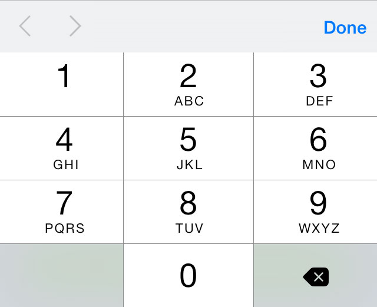
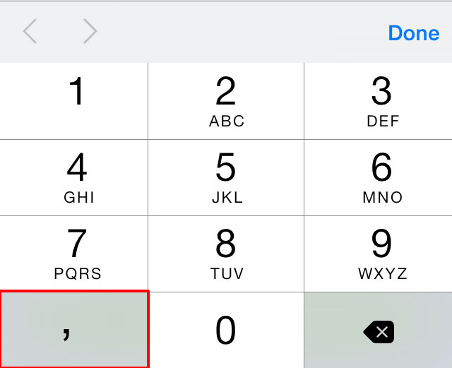

# Numeric input and keyboard on mobile

It's really anoying when trying to enter numeric data in a web page/app from a mobile device using a virtual keyboard.

One way to help the user to improve her experience is to address the browser to provide the most fitted keyboard. 

```html
<input type="number"
       pattern="[0-9]*"
       inputmode="decimal"/>
```

The ```pattern="[0-9]*"``` attribute makes the trick of showing the numeric virtual keyboard.

The ```inputmode="decimal"``` attribute is important, otherwise, in iPhone it will not include the decimal point.





